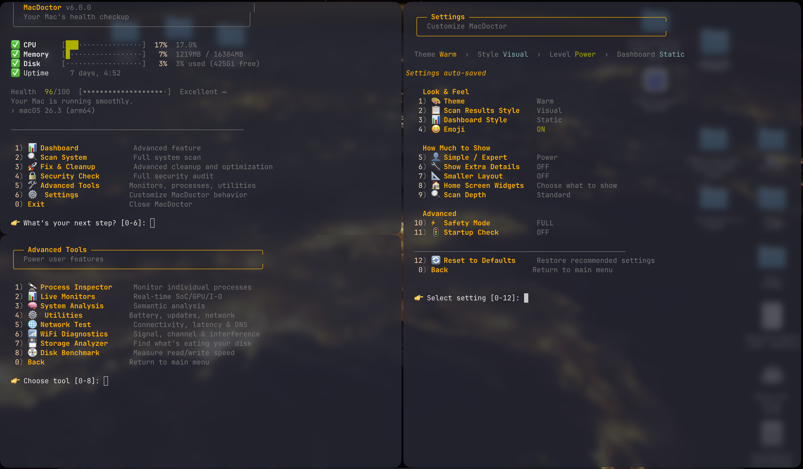

# MacDoctor

MacDoctor is a terminal tool for inspecting common macOS health, storage, startup, network, and security issues from one `zsh` script.

  



## Install

```bash
git clone https://github.com/magido87/Macdoctor.git
cd Macdoctor
chmod +x macdoctor.sh
./macdoctor.sh
```

Optional alias:

```bash
alias macdoctor="/path/to/macdoctor.sh"
```

## What it does

MacDoctor collects local system information and presents it in a menu-driven interface. Depending on the menu you choose, it can:

- show a live or static system overview
- run read-only scans for CPU, memory, disk, startup items, logs, caches, battery, network, and security settings
- estimate the impact of cleanup actions before you run them
- remove selected caches, temporary files, logs, and other rebuildable data
- run maintenance tools such as network tests, disk benchmarks, and process inspection

The scan modes are:

- `Quick Scan`: basic read-only check of current system load and common issues
- `Deep Scan`: broader read-only check of caches, logs, startup items, storage, and security
- `Ultra Scan`: most detailed read-only audit and report generation

The cleanup modes are:

- `Safe Cleanup`: browser caches, temporary files, and user logs
- `Deeper Cleanup`: larger rebuildable app and developer data
- `Aggressive Cleanup`: system-level maintenance that may require `sudo`

## Requirements

- macOS 12 or newer
- `zsh`
- a terminal with 256-color support

Optional:

- Homebrew for some extended checks
- `sudo` for parts of deep scans, benchmarks, and system cleanup

## Notes

- Most scan features are read-only.
- Some advanced tools and fixes may prompt for `sudo`.
- Results depend on what macOS allows standard shell tools to read on the current machine.
- Settings are stored in `~/.config/macdoctor/settings.conf`.

## Project structure

```text
Macdoctor/
├── macdoctor.sh
├── .gitignore
└── README.md
```

## Contributing

1. Fork the repository.
2. Create a branch.
3. Run `zsh -n macdoctor.sh`.
4. Test the script on macOS.
5. Open a pull request.

## License

MIT
